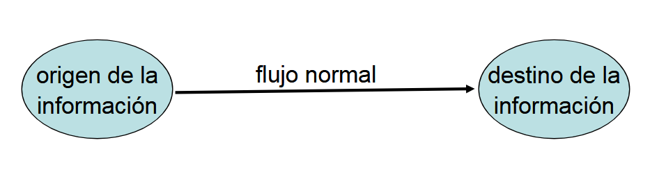
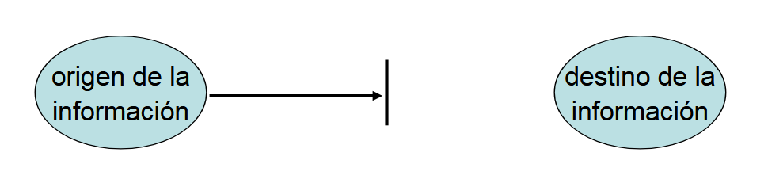
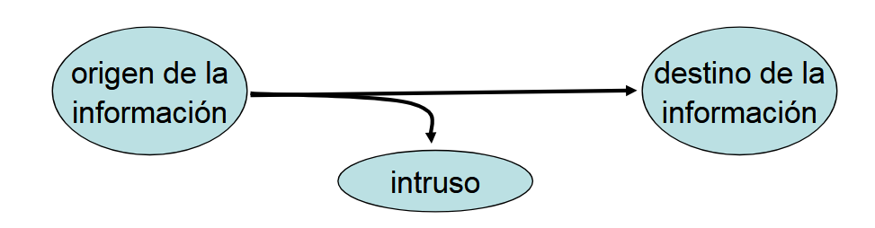
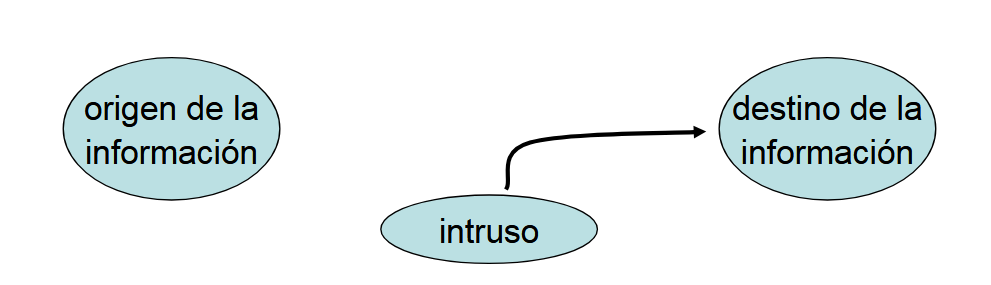

# Introducción

## Conceptos generales

**Información**: Se refiere a toda **comunicación** o **representación de conocimiento** como **datos** en cualquiera de sus formas (textuales, numéricas, gráficas, cartográficas, narrativas o audiovisuales), y en cualquier medio (magnético, papel, pantallas, audiovisual, etc).
Ejemplos de información: Documentos, informes, archivos, comunicaciones, sistemas, datos personales, claves.

**Seguridad de la información**: La preservación de las siguientes tres características: 

- **Confidencialidad**: Se garantiza que la información sea accesible sólo a aquellas personas autorizadas a tener acceso a la misma. 

- **Integridad**: Se salvaguarda la exactitud y totalidad de la información y los métodos de procesamiento. La integridad incluye la integridad del contenido y el origen de los mismos.

- **Disponibilidad**: Se garantiza que los usuarios autorizados tengan accedo a la información y a los recursos relacionados con la misma, toda vez que lo requieran.

Una **vulnerabilidad** es una debilidad en un activo. Una **amenaza** es una violación potencial de la seguridad. No es necesario que la violación ocurra para que la amenaza exista. Las amenazas **explotan** vulnerabilidades. Las acciones que causan dicha violación son llamadas **ataques**. 

## Tipos de amenazas

### Flujo normal de la información:

### Interrupción del flujo de información:

- Destrucción, bloqueo o saturación del recurso. Amenaza a la **disponibilidad** de la información.

### Intercepción de información:

- Acceso no autorizado al recurso, monitoreo de información, ingeniería social. Amenaza a la **confidencialidad** de la información.

### Alteración de información

- Modificación del recurso. Amenaza a la **integridad** de la información.

### Fabricación de información

- Incorporación de información, envío de mensajes falsos (*phishing¨*). Amenaza a la **autenticidad** de la información. 

### Amenazas pasivas

El atacante **observa**, **recopila** o **analiza** información pero **no modifica** ni **interfiere** directamente con los sistemas o datos. Generalmente son muy difíciles de detectar y dependen del medio físico de transmisión. 

Los ejemplos clásicos son el **sniffing** ("escuchar" el tráfico de una red para capturar información) y el **side channel attack** (mirar características secundarias de un sistema, como los tiempos de respuesta, consumo, etc).

### Amenazas activas

El atacante **interviene** en los sistemas o en la información, provocando alteraciones, interrupciones o insertando información. Son más simples de detectar, ya que los efectos son más visibles. 
Algunos ejemplos:

- **Keylogger**: un programa o dispositivo que registra cada tecla que se presiona, con el objetivo de robar credenciales de acceso o información sensible.
- **Spoofing**: ocurre cuando el atacante suplanta la identidad de otra persona o sistema.
- **Replay attack**: consiste en capturar mensajes legítimos y reenviarlos más tarde para confundir al sistema.
- **Tampering**: consiste en alterar o falsificar la información transmitida o almacenada. Puede ser cambiar un paquete en tránsito de red o algún archivo en una base de datos.
- **Port scanning**: escaneo para descubrir los servicios expuestos en un sistema.
- **Exploit**: usar un código o técnica para aprovechar un bug o vulnerabilidad en un software.
- **Man in the middle**: el atacante se posiciona en el "medio" de la comunicación, interceptando, alterando o inyectando datos.
- **Denial Of Service**: consiste en saturar un sistema con solicitudes falsas para que no pueda atender a usuarios legítimos.

### Políticas y mecanismos

Una **política** de seguridad es una declaración de lo que está permitido y lo que no. Es un conjunto de reglas y objetivos que una organización define para proteger su información y sistemas. Define quién tiene acceso, cómo se manejan los datos.
Un **mecanismo** de seguridad es un método, herramienta o procedimiento para hacer cumplir una política de seguridad. Los mecanismos pueden ser no técnicos, y se aplican mediante software, hardware u otros procesos. 

## Objetivos de la seguridad

- **Prevención**: Evitar que el ataque suceda, o en caso de hacerlo, que no sea exitoso.
- **Detección**: Cuando un ataque no puede ser prevenido y se da por hecho de que va a ocurrir, reportar los daños que se produzcan.
- **Recuperación**: Luego de producido un ataque, se procede a detenerlo, y a determinar y reparar daños. 

Cualquier política y mecanismo útil deben balancear los beneficios de la protección con el costo del diseño, implementación y utilización del mecanismo. Este balance puede ser determinado analizando los riesgos y la probabilidad de ocurrencia. 
Se entiende por **evaluación de riesgos** a la evaluación de las amenazas y vulnerabilidades relativas a la información, y a las instalaciones de procesamiento de la misma, la probabilidad de que ocurran y su potencial impacto en la operatoria de la organización. 

Es complejo implementar controles de seguridad informática, y en una organización grande, los controles pueden volverse vagos o incómodos. Si se los configura en forma inadecuada o se los usa incorrectamente, hasta los mejores controles de seguridad se vuelven inútiles o incluso peligrosos. Personal no entrenado puede ser una amenaza para la seguridad de un sistema. Además, el entrenamiento necesario no solamente es técnico. Muchos ataques exitosos provienen del uso de la **ingeniería social**. 